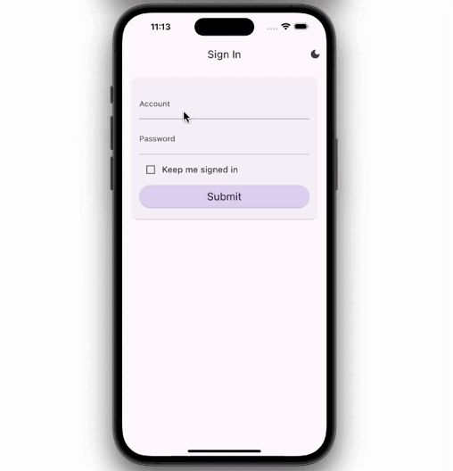

# Flutterprint

[![License: MIT][license_badge]][license_link]
[](https://github.com/felangel/mason)

Your Blueprint for Building Maintainable and Scalable Flutter Apps runs on Android, iOS, and Web.

### Credits
This project was originally developed by [Very Good Ventures][very_good_ventures_link] 🦄

It has been forked and adapted for creating different App templates by Danny Chuang.

This fork is not officially maintained or affiliated with Very Good Ventures.

---
## Getting Started 🚀
This app template can be generated using [mason_cli][mason_cli_link] with customized variables.

Ensure you have [mason_cli][mason_cli_link] installed.

```sh
# Activate mason_cli from https://pub.dev
dart pub global activate mason_cli
```
```sh
# Or install from https://brew.sh
brew tap felangel/mason
brew install mason
```

Installation
```sh
# Install locally
mason add flutterprint --git-url https://github.com/ycchuang305/flutterprint --git-path brick/
```
```sh
# Or install globally
mason add -g flutterprint --git-url https://github.com/ycchuang305/flutterprint --git-path brick/
```

Usage 🚀
```sh
# Generate the flutterprint app template
mason make flutterprint
```

Flutterprint uses [freezed][freezed_link] to generate data-classes/unions, the generated codes `*.freezed.dart `are included in this template. However you may need to run the code generator command after creating new freezed classes.

```sh
flutter pub run build_runner build --delete-conflicting-outputs
```
---
## Variables ✨

| Variable           | Description                     | Default             | Type     |
| ------------------ | ------------------------------- | ------------------- | -------- |
| `project_name`     | The project name                | my_app              | `string` |
| `org_name`         | The organization name           | com.example         | `string` |
| `application_id`   | The application id on Android, Bundle ID on iOS and company name on Windows. If omitted value will be formed by org_name + . + project_name.       | (empty)             | `string` | 
| `description`      | A short project description     | A Flutter blueprint | `string` |

---
## Preview 📱


---
## What's Included ✨

Out of the box, Flutterprint includes:

- ✅ [Cross Platform Support][flutter_cross_platform_link] - Built-in support for iOS, Android, and Web.
- ✅ [Go Router][go_router_link] - A declarative routing package that uses url-based API for navigating between different screens.
- ✅ [Internationalization Support][internationalization_link] - Internationalization support using synthetic code generation to streamline the development process.
- ✅ [Riverpod][riverpod_link] - A reactive caching and data-binding framework.
- ✅ [Testing][testing_link] - Unit and Widget Tests
- ✅ [Continuous Integration][github_actions_link] - Lint, format, test, and enforce code coverage using [GitHub Actions][github_actions_link]
- ✅ Dependabot Integration

---

## Features
- ✨**Token-based Authentication Flow**

   The app provides a demonstration of a token-based authentication flow, including sign in and refresh token strategy. It uses a fake authentication repository by default, but can easily be configured to use a backend for user authentication by modifying the configuration settings and using the REST API service that is provided by this template. The authentication flow allows users to securely access protected resources and maintain an authenticated state throughout the session.

- ✨**Backend Environment Switching**
  
  The app demonstrates a feature that allows the user to easily switch between different backend environments (such as release, demo, development, or even localhost) and configure the baseURL and API endpoints for each environment, which enables seamless testing and development.

- ✨**Redirection Logic**
  
  The app uses [go_router][go_router_link] combined with [riverpod][riverpod_link] to handle redirect logic that automatically redirects the user to the appropriate pages based on the user's authenticated state. This feature is handled throughout the app and provides a seamless experience for the user by ensuring that they are always directed to the correct page. For instance, whether the user is authenticated or unauthenticated, they will be redirected to the home page or sign-in page, respectively.
  
- ✨**REST API Service**
  
  A service provides a simple interface for performing CRUD operations on a remote server, returning results in the form of `Future<Either<ApiFailure, T>>` indicating whether the request was successful or not. If the request is successful, `T` is the generic type of desired domain model deserialized from the json response, otherwise `ApiFailure` is the union class that provide a pattern-matching way to handle different types of errors.
  
---

## Development Guideline

**Project layout**

The app template is structured in a `feature-first(layers inside features)` way to make it easy to add new features and maintain the codebase. This folder contains all the different features of the app, organized into subfolders by feature name. Each feature folder contains subfolders for data, domain, application and presentation layers.

When adding a new feature to the app, it is recommended to create a new folder in the `lib/features` folder and structure it similarly to the existing feature folders. This will help keep the codebase organized and make it easy to find and maintain the code for each feature.

```sh
├── lib
│   ├── features
│   │   ├── feature1 
│   │   │   ├── presentation
│   │   │   ├── application
│   │   │   ├── domain
│   │   │   └── data
│   │   └── feature2
│   │   │   ├── presentation
│   │   │   ├── application
│   │   │   ├── domain
│   │   │   └── data
```

Each layer has its own role for a given feature:
- The `domain` layer holds the models that are specific to the feature.
- The `data` layer holds the repositories that handle communication with remote or local data sources, providing `domain` data to the application layer. 
- The `application` layer handles logic and state management, using data from the data layer to fulfill the app's requirements. 
- The `presentation` layer contains the UI widgets that users interact with, rendered based on the state managed in the application layer.


**Provider's life-cycle**

  It is a good practice to add the `.autoDispose` modifier to your providers, as it ensures that they are disposed as soon as all of their listeners are removed, avoiding unnecessary costs.

  On the other hand, if you want to keep some state in memory and always have it available while the app is running, you can keep it alive. For example, when using Riverpod for dependency injection, you can create long-lived providers for objects that you want to instantiate just once (such as wrappers for third-party APIs like FirebaseAuth or SharedPreferences).
  
---
## Configurations 🔧

- **Authentication Repository**
    
    The `AuthRepository` provider uses a fake repository by default for demonstration purpose. To use a real implementation, replace the fake repository with your own implementation in the `auth_repository.dart` located in the `lib/features/authentication/data` directory.

- **Backend baseURL and API endpoints**
    
    You can configure the backend base environment in the `backend_env.dart` and API endpoints in the `endpoints.dart` that are located in the `lib/features/backend_environment/domain` directory.

- **Routes**
    
    The routes for the app are defined and declared in the `app_router.dart`, which is located in the `lib/router` directory. For more information, please refer to [go_router][go_router_link].

---

## Running Tests 🧪

To run all unit and widget tests use the following command:

```sh
$ flutter test --coverage --test-randomize-ordering-seed random
```

To view the generated coverage report you can use [lcov](https://github.com/linux-test-project/lcov).

```sh
# Generate Coverage Report
$ genhtml coverage/lcov.info -o coverage/

# Open Coverage Report
$ open coverage/index.html
```

---

## Working with Translations 🌐

This project relies on [flutter_localizations][flutter_localizations_link] and follows the [official internationalization guide for Flutter][internationalization_link].

### Adding Strings

1. To add a new localizable string, open the `app_en.arb` file at `lib/l10n/arb/app_en.arb`.

```arb
{
    "@@locale": "en",
    "account": "Account",
    "@account": {
        "description": "Text shown in the title of account text field"
    },
}
```

2. Then add a new key/value and description

```arb
{
    "@@locale": "en",
    "account": "Account",
    "@account": {
        "description": "Text shown in the title of account text field"
    },
    "helloWorld": "Hello World",
    "@helloWorld": {
        "description": "Hello World Text"
    }
}
```

3. Use the new string

```dart
import 'package:flutterprint/l10n/l10n.dart';

@override
Widget build(BuildContext context) {
  final l10n = context.l10n;
  return Text(l10n.helloWorld);
}
```

### Adding Supported Locales

Update the `CFBundleLocalizations` array in the `Info.plist` at `ios/Runner/Info.plist` to include the new locale.

```xml
    ...

    <key>CFBundleLocalizations</key>
	<array>
		<string>en</string>
		<string>zh</string>
	</array>

    ...
```

### Adding Translations

1. For each supported locale, add a new ARB file in `lib/l10n/arb`.

```
├── l10n
│   ├── arb
│   │   ├── app_en.arb
│   │   └── app_zh.arb
```

2. Add the translated strings to each `.arb` file:

`app_en.arb`

```arb
{
    "@@locale": "en",
    "account": "Account",
    "@account": {
        "description": "Text shown in the title of account text field"
    },
}
```

`app_zh.arb`

```arb
{
    "@@locale": "zh",
    "account": "帳號",
    "@account": {
        "description": "用於帳號欄位的標題文字"
    },
}
```

---
## Acknowledgments
Some of the project's structure and test flow were inspired by [Andrea Bizzotto](https://github.com/bizz84). I would like to acknowledge and thank him for the inspiration he provided through his work.

[coverage_badge]: src/my_app/coverage_badge.svg
[flutter_cross_platform_link]: https://flutter.dev/docs/development/tools/sdk/release-notes/supported-platforms
[flutter_localizations_link]: https://api.flutter.dev/flutter/flutter_localizations/flutter_localizations-library.html
[freezed_link]: https://pub.dev/packages/freezed
[github_actions_link]: https://github.com/features/actions
[go_router_link]: https://pub.dev/packages/go_router
[internationalization_link]: https://flutter.dev/docs/development/accessibility-and-localization/internationalization
[license_badge]: https://img.shields.io/badge/license-MIT-blue.svg
[license_link]: https://opensource.org/licenses/MIT
[mason_cli_link]: https://pub.dev/packages/mason_cli
[riverpod_link]: https://riverpod.dev/
[testing_link]: https://flutter.dev/docs/testing
[very_good_ventures_link]: https://verygood.ventures/?utm_source=github&utm_medium=banner&utm_campaign=core